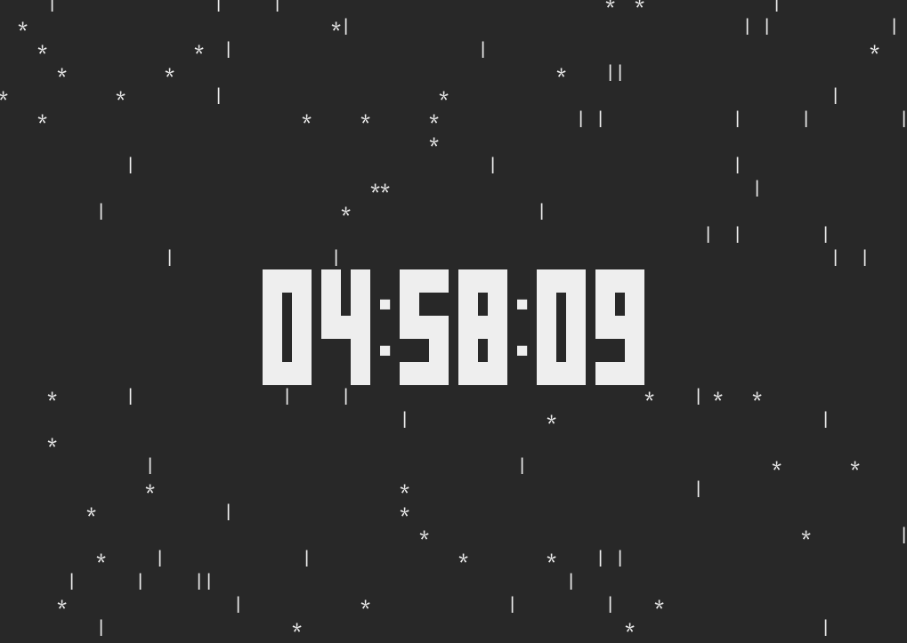

# era

v0.1.0  
A rainy clock in your terminal, written with Deno.


## Usage

First, git clone and compile it.  
_Compilation requires Deno._

```
git clone https://github.com/kyoheiu/era
cd era
make
```

Then,

```
./era
```

creates `config.json` in your `CONFIG_HOME/era/` automatically and you have a rainy clock.

To exit, press any key.

## Customization

`config.json` looks like this:

```
{"interval":100,"frequency":40,"rain1":"│","rain2":" "}
```

`interval` means how often the screen is updated (a.k.a how fast it rains). The bigger this number, The faster it rains.  
The larger `frequency`, the fewer the raindrops.  
`rain1` and `rain2` are characters representing raindrops. By default `rain2` is just a whitespace, so raindrops are represented by rain1 (|) only. Of course you can change the shape of raindrops!




