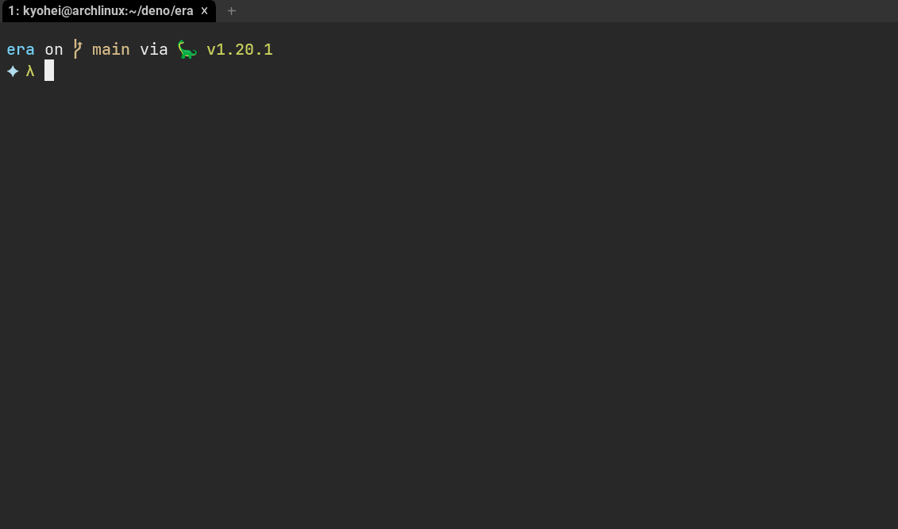
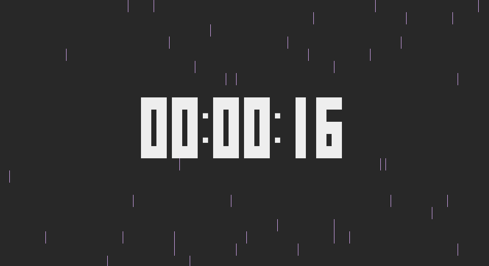

# era

A rainy clock in your terminal, written with Deno.



## v0.1.1
Now era can redraw contents if the terminal window size is changed.

## Installation

- git clone this repo and compile it.

```
git clone https://github.com/kyoheiu/era
cd era
make install
```

- Or, you can use binary from the release page.

## Usage

```
./era
```

creates `config.json` in your `$XDG_CONFIG_HOME/era/` automatically and you have a rainy clock.

NOTE: `era` assumes the value is `~/.config` if `$XDG_CONFIG_HOME` isn't defined as an environment variable.

Or,

```
./era -c
```

starts counter like this.



To exit, press any key.

## Customization

`config.json` looks like this:

```
{"interval":100,"frequency":40,"rain1":"│","rain2":" ","timecolor":"#eeeeee","raincolor":"#e0b0ff"}
```

`interval` means how often the screen is updated (a.k.a how fast it rains). The bigger this number, The slower it rains.
The larger `frequency`, the fewer the raindrops.
`rain1` and `rain2` are characters representing raindrops. By default `rain2` is just a whitespace, so raindrops are represented by rain1 (|) only. Of course you can change the shape of raindrops!
